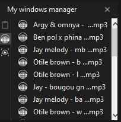

# Win manager



## Description

This is tkinter-based-app will perform a various window operations as a clone,such as clipboard,music player,optimisations(e.g cleaning up temporary files in window.).

## Table of Contents

- [Installation](#installation)
- [Usage](#usage)
- [Features](#features)
- [Contact](#contact)

## Installation

Instructions on how to install and set up your project locally.

```bash
# Clone the repository
git clone https://github.com/Yegon-David/windows-manager.git

# Navigate into the project directory
cd windows-manger

#setup virtual environment
python -m venv env
env\scripts\activate

# Install dependencies
pip install -r requirements.txt
```

## usage

```bash
python winmanage.py
```

## Features

### Page Navigation

- **Multi-Page Interface**: The app includes multiple pages that users can navigate between using intuitive buttons.
- **Smooth Transitions**: Page navigation is designed to be seamless and responsive, enhancing the user experience.

### Audio Management

- **Music File Listing**: Users can browse and view a list of music files directly within the app.
- **Audio Playback**: Click on a listed music files. Playin audio is in the works still.Z!

### Clipboard Simulation

- **Clipboard Page**: A dedicated page simulates clipboard functionality, allowing users to copy and paste text within the app.

### Interactive UI Elements

- **Hover Effects**: Buttons and interactive elements change color when hovered over, providing visual feedback and improving usability.
- **Top-Level Display of Labels**: Tooltips and additional information are shown using top-level displays when interacting with certain elements.

### Planned Features

- **Video Player**: A feature for playing audio files is in the works and will be available in future updates.

## Contact

- Email: [onepieceprogramming@gmail.com](mailto:onepieceprogramming@gmail.com)
- GitHub: [Yegon-David](https://github.com/Yegon-David)
